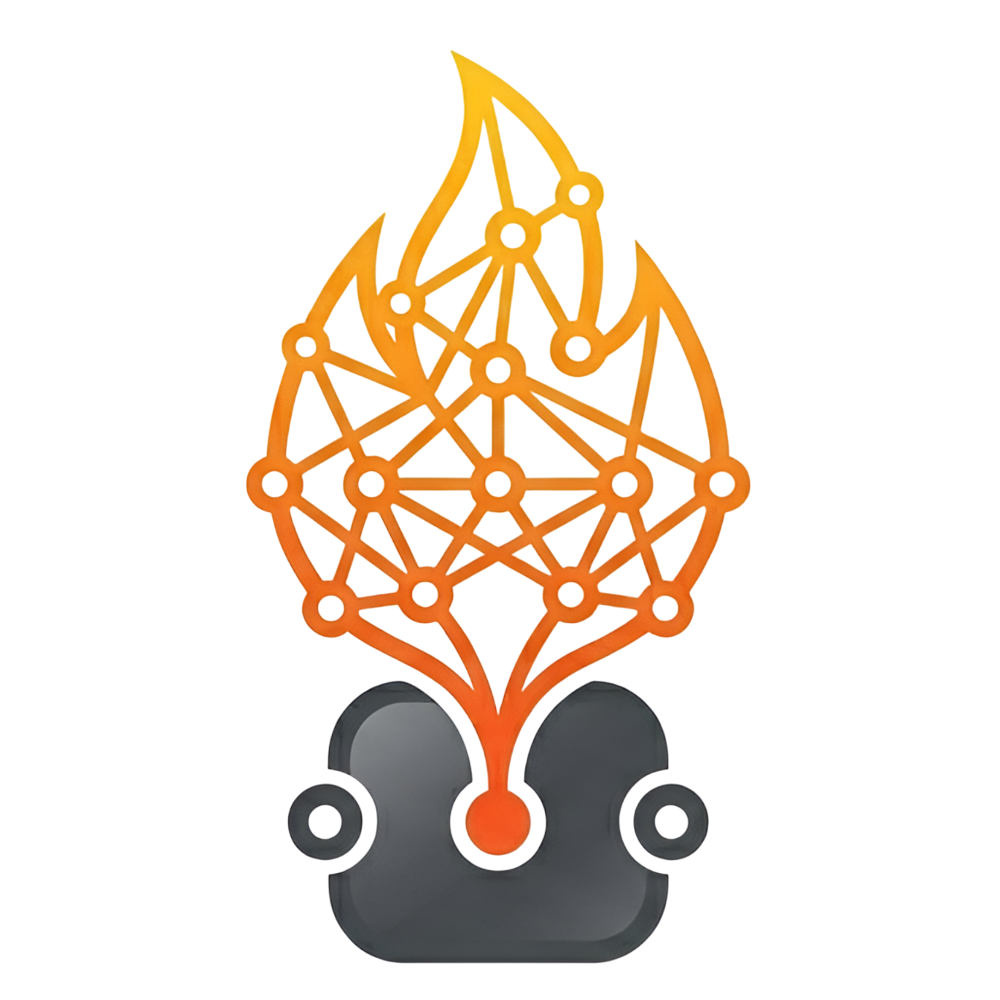

<p align="center">
  
</p>
<h1 align="center">NodeTorch</h1>
<p align="center">Node-based visual tool for building, inspecting, and understanding ML models. Educational and open-source.</p>

Build neural networks by dragging nodes onto a canvas and connecting them. Shape inference runs instantly as you edit. Click "Run" to execute a real forward pass with PyTorch.

## Setup

### Frontend

```bash
npm install
npm run dev
```

Opens at http://localhost:5173.

### Backend

Requires Python 3.12.

```bash
# Create venv
python3 -m venv .venv
source .venv/bin/activate

# Install PyTorch (pick your CUDA version from https://pytorch.org/get-started/locally/)
pip install torch torchvision --index-url https://download.pytorch.org/whl/cu128

# Install remaining dependencies
pip install -r requirements.txt

# Run the server
cd backend
python main.py
```

Runs at http://localhost:8000.

## Usage

1. **Add nodes** — drag from the palette (left sidebar) onto the canvas
2. **Connect nodes** — drag from an output port to an input port
3. **Edit properties** — click a node, edit in the inspector (right panel)
4. **Shape inference** — happens automatically as you connect and edit
5. **Run forward pass** — click "Run" (requires backend running)
6. **Save/Load** — toolbar buttons export/import the graph as JSON
